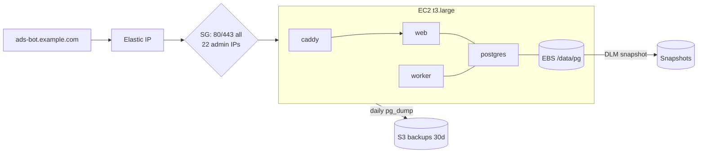
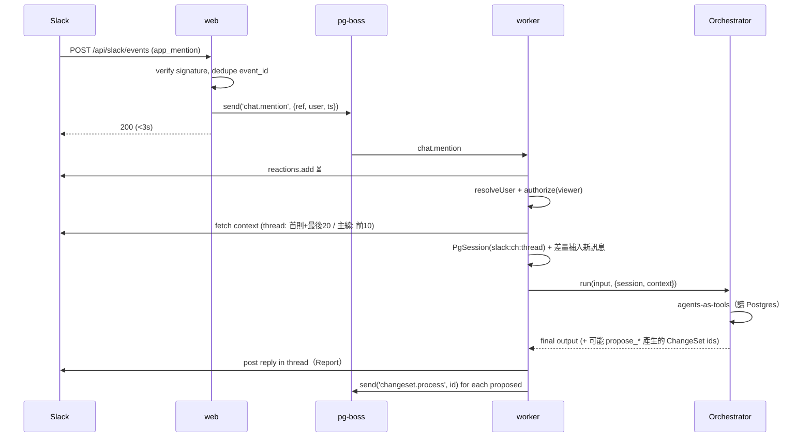
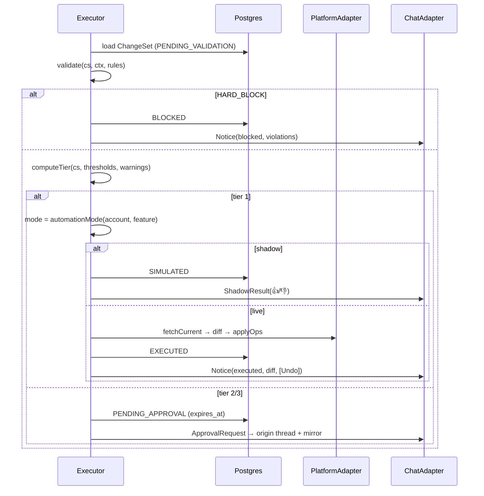
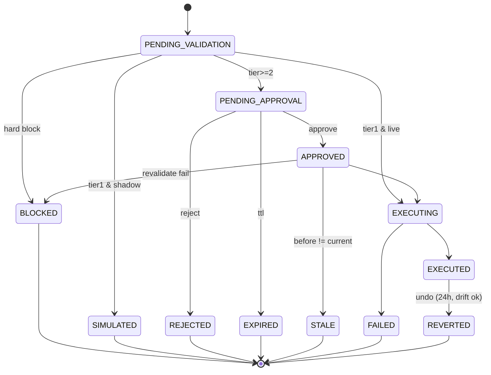

# Design Document — Arlo Ads Bot

## Overview

Arlo Ads Bot 由兩個 process 組成：**web**（Next.js：UI、API、Slack endpoints）與 **worker**（Node：agents、Executor、Monitor、Sync、Scheduler），共用一個 Postgres（資料 + pg-boss queue + agent sessions）。

設計的核心是一條**決定性的寫入管線**：

```
Agent (LLM) ──propose──► ChangeSet ──► Executor (no LLM)
                                        validator → tier → approval → re-fetch → mutate → audit
```

LLM 只負責理解、分析、提議、解釋；任何金錢相關的決定（是否擋下、是否需要人審、執行的數字、熔斷條件、預算分配）都由可單元測試的純函式決定。

### 關鍵決策一覽

| 主題 | 決策 | ADR |
|---|---|---|
| 租戶 | 內部單一 org，保留 `org_id` | [0001](../../../docs/adr/0001-single-org-internal-tool.md) |
| 架構 | monorepo、Next.js + worker、pg-boss | [0002](../../../docs/adr/0002-monorepo-nextjs-worker-pgboss.md) |
| 資料 | 定時同步進 Postgres | [0003](../../../docs/adr/0003-postgres-scheduled-sync.md) |
| 平台抽象 | PlatformAdapter 核心 + 平台擴充 | [0004](../../../docs/adr/0004-platform-adapter.md) |
| Chat 抽象 | 語意層 ChatAdapter | [0005](../../../docs/adr/0005-chat-adapter.md) |
| 寫入邊界 | Agent 只產生 ChangeSet | [0006](../../../docs/adr/0006-agent-proposes-executor-executes.md) |
| 風險 | Tier 0–3 + Hard block | [0007](../../../docs/adr/0007-risk-tiers.md) |
| Validator | 固定規則型別 | [0008](../../../docs/adr/0008-validator-typed-rules.md) |
| Approval | TTL + 執行前重驗 | [0009](../../../docs/adr/0009-approval-ttl-optimistic-revalidation.md) |
| 身分 | Google SSO + Slack 對應 + RBAC | [0010](../../../docs/adr/0010-identity-rbac.md) |
| 路由 | 原 thread + approval channel 鏡像 | [0011](../../../docs/adr/0011-approval-routing.md) |
| Undo | 24h 一鍵 + 漂移檢查 | [0012](../../../docs/adr/0012-undo-time-window.md) |
| 信任 | off / shadow / live | [0013](../../../docs/adr/0013-automation-modes-shadow.md) |
| Agents | Orchestrator + agents-as-tools | [0014](../../../docs/adr/0014-agent-topology.md) |
| 對話 | Thread = Session | [0015](../../../docs/adr/0015-thread-session-context.md) |
| 排程 | Job 模板 + 可選 prompt | [0016](../../../docs/adr/0016-scheduled-job-templates.md) |
| 熔斷 | 決定性 Monitor | [0017](../../../docs/adr/0017-deterministic-monitor.md) |
| 預算 | 演算法分配，agent 解釋 | [0018](../../../docs/adr/0018-budget-optimizer.md) |
| 否定字 | Business Profile + 硬性防護 | [0019](../../../docs/adr/0019-negative-keywords-profile.md) |
| Campaign | Search、Draft、PAUSED | [0020](../../../docs/adr/0020-campaign-agent-scope.md) |
| 審計 | Ads 診斷 + GA4 | [0021](../../../docs/adr/0021-tracking-audit-ads-ga4.md) |
| 受眾 | v1 只分析 | [0022](../../../docs/adr/0022-audience-analysis-only.md) |
| 模型 | 分級 + 成本上限 | [0023](../../../docs/adr/0023-model-tiering-llm-budget.md) |
| Tracing | OpenAI 預設 + trace_id | [0024](../../../docs/adr/0024-tracing-openai-default.md) |
| 部署 | 單台 EC2 + docker compose | [0025](../../../docs/adr/0025-deploy-single-ec2-compose.md) |
| 測試環境 | 寫入白名單、分層測試 | [0026](../../../docs/adr/0026-dev-test-environment.md) |
| 分期 | M0–M4 | [0027](../../../docs/adr/0027-delivery-phasing.md) |

### 外部依賴

| 用途 | 套件 / API |
|---|---|
| Agents | `@openai/agents`（openai-agents-js）、`zod` |
| Google Ads | `google-ads-api`（Opteo, REST + protobuf） |
| GA4 | `@google-analytics/data` |
| Slack | `@slack/web-api`（events/interactivity 由 Next.js route 自行驗簽） |
| Web auth | Auth.js（Google provider） |
| DB / Queue | Postgres、`drizzle-orm` + `drizzle-kit`、`pg-boss` |
| UI | Next.js App Router、Tailwind、shadcn/ui、Recharts |
| 測試 | Vitest、Testcontainers |
| Log | pino（JSON → stdout） |

所有版本使用撰寫時最新穩定版；Node 使用當前 Active LTS。

---

## Architecture

### 元件圖

```mermaid
graph TD
  subgraph Slack
    SU[Users] -->|@bot / buttons| SA[Slack App]
  end
  subgraph EC2["EC2 (docker compose)"]
    C[Caddy :443] --> W[web: Next.js]
    W -->|enqueue| PG[(Postgres<br/>data + pg-boss + sessions)]
    WK[worker] -->|dequeue| PG
    subgraph worker
      WK --> CH[Chat handler]
      WK --> SCH[Scheduler]
      WK --> SY[Sync]
      WK --> MON[Monitor]
      WK --> EX[Executor]
      WK --> CT[Campaign task runner]
      CH --> AG[Agents<br/>Orchestrator + specialists]
      SCH --> AG
      CT --> AG
      AG -->|propose_*| CS[ChangeSet repo]
      MON --> CS
      CS --> EX
    end
  end
  SA -->|events / interactivity| C
  U2[Web users] -->|Google SSO| C
  SY -->|GAQL| GADS[Google Ads API]
  EX -->|re-fetch / mutate| GADS
  SY -->|Data API| GA4[GA4]
  AG -->|Responses API + traces| OAI[OpenAI]
  EX -->|ChatAdapter| SA
  BK[backup.sh cron] -->|pg_dump| S3[(S3)]
```

### Monorepo 結構

```
apps/
  web/                    Next.js：pages、route handlers、server actions
    app/api/slack/events/route.ts
    app/api/slack/interactivity/route.ts
    app/api/healthz/route.ts
  worker/                 entry：註冊 pg-boss handlers 與 schedules
    src/handlers/{chat,sync,monitor,executor,scheduler,campaign}.ts
packages/
  core/                   純邏輯，無 I/O
    changeset/  tier/  validator/  monitor/  optimizer/  lint/  anomaly/  authz/
  db/                     Drizzle schema、migrations、repositories
  adapters/
    platform/             PlatformAdapter、GoogleAdsAdapter、FakePlatformAdapter
    chat/                 ChatAdapter、SlackAdapter、renderers
    ga4/
  agents/                 agent 定義、tools、prompts、PgSession、models config
  config/                 env schema（zod）
evals/                    agent golden sets + runner
infra/
  docker/                 Dockerfile.web、Dockerfile.worker
  caddy/Caddyfile
scripts/                  deploy.sh、backup.sh、restore.sh、migrate.ts
docker-compose.yml        本機
docker-compose.prod.yml   EC2
```

**邊界規則**（eslint `no-restricted-imports`）：
- `packages/core` 不得 import 任何 I/O 套件。
- `PlatformAdapter.applyOps` 只能由 `apps/worker/src/handlers/executor.ts` 呼叫。
- `packages/agents` 不得 import `adapters/platform` 的 mutate 介面。

### 部署圖（v1）



---

## 主要流程

### 1. Slack @mention → Orchestrator



### 2. ChangeSet 管線（Executor）



Approve 時：

```
authorize(user, 'approve', cs) → (tier 3: confirm modal + requester≠approver)
→ CAS status PENDING_APPROVAL→APPROVED
→ fetchCurrent; any op.current ≠ op.before → STALE
→ validate again with fresh ctx → BLOCKED?
→ assertWriteAllowed(customerId) → applyOps → EXECUTED / FAILED
→ update all approval_messages
```

### 3. ChangeSet 狀態機



`transition(cs, event) → cs | Error` 為純函式；DB 層以 `UPDATE ... WHERE id=? AND status=?` 做 CAS。

### 4. Monitor 熔斷

```
[every 15m after snapshot sync]
for account, rule in enabled monitor rules:
  metrics = load window
  if evaluate(rule, metrics) and not inCooldown(entity, rule):
    cs = ChangeSet(source=monitor, ops=[pause|reduce_budget|reduce_target], feature='circuit_breaker')
    → Executor（強制 tier 1 前提：op 為保護性；否則依 computeTier）
    → enqueue('audit.explain', cs.id)   // 非同步，LLM 預算用盡時改用模板文字
```

### 5. Campaign task

```
Web submit brief → campaign_tasks(queued) → pg-boss 'campaign.generate'
→ Campaign agent (structured output: CampaignDraft)
→ lintRsa / lintStructure → 失敗則回饋 agent 修正（≤2 次）
→ campaign_drafts(status=draft) → Web 編輯 / 局部重生（'campaign.regenerate', section）
→ Submit → ChangeSet(ops=[google.create_campaign_bundle{status: PAUSED}], tier ≥ 2)
→ approved → Executor 建立（temporary resource names, partialFailure=false）
→ 'Enable' 按鈕 → 新 ChangeSet(set_status ENABLED)
→ 每日 sync policy_summary → draft.policy_status
```

---

## Components and Interfaces

### Config（`packages/config`）

```ts
const Env = z.object({
  DATABASE_URL: z.string().url(),
  APP_BASE_URL: z.string().url(),
  AUTH_SECRET: z.string(),
  GOOGLE_OAUTH_CLIENT_ID: z.string(), GOOGLE_OAUTH_CLIENT_SECRET: z.string(),
  ALLOWED_WORKSPACE_DOMAIN: z.string(),
  SLACK_BOT_TOKEN: z.string(), SLACK_SIGNING_SECRET: z.string(),
  SLACK_APPROVAL_CHANNEL_ID: z.string(), SLACK_OPS_CHANNEL_ID: z.string(),
  GOOGLE_ADS_DEVELOPER_TOKEN: z.string(), GOOGLE_ADS_CLIENT_ID: z.string(),
  GOOGLE_ADS_CLIENT_SECRET: z.string(), GOOGLE_ADS_REFRESH_TOKEN: z.string(),
  GOOGLE_ADS_LOGIN_CUSTOMER_ID: z.string(),
  ADS_WRITE_ALLOWED_CUSTOMER_IDS: z.string().transform(csv),   // ADR-0026
  GA4_SERVICE_ACCOUNT_JSON: z.string().optional(),
  OPENAI_API_KEY: z.string(),
  MODEL_FLAGSHIP: z.string(), MODEL_SMALL: z.string(),
  DAILY_LLM_BUDGET_USD: z.coerce.number().default(30),
  BACKUP_S3_BUCKET: z.string().optional(),
});
```

### PlatformAdapter（ADR-0004）

```ts
type Platform = 'google_ads';

interface EntityRef { platform: Platform; accountId: string; kind: EntityKind; id: string }
type EntityKind = 'campaign' | 'ad_group' | 'keyword' | 'shared_set' | 'campaign_budget';

interface PlatformAdapter {
  platform: Platform;
  listAccounts(): Promise<AccountInfo[]>;
  fetchEntities(accountId: string, kinds: EntityKind[]): Promise<EntitySnapshot[]>;
  fetchMetrics(q: MetricsQuery): Promise<MetricRow[]>;            // date range, level, segments
  fetchChangeHistory(accountId: string, since: Date): Promise<ChangeEventRow[]>;
  fetchCurrent(refs: EntityRef[]): Promise<Map<string, Record<string, unknown>>>;
  applyOps(accountId: string, ops: Op[]): Promise<OpResult[]>;    // Executor only
}

interface GoogleAdsExtensions {
  fetchSearchTerms(accountId: string, range: DateRange): Promise<SearchTermRow[]>;
  fetchConversionActions(accountId: string): Promise<ConversionActionRow[]>;
  fetchUserListMetrics(accountId: string, range: DateRange): Promise<AudienceRow[]>;
  fetchBudgetSimulations(accountId: string, campaignIds: string[]): Promise<BudgetSimRow[]>;
  generateKeywordIdeas(accountId: string, seeds: string[]): Promise<KeywordIdea[]>;
}
```

`FakePlatformAdapter`：in-memory 狀態，供 Executor / 整合測試使用。

### ChangeSet（ADR-0006/0007）

```ts
type OpKind =
  | 'set_budget' | 'set_status' | 'set_bid_target'                 // core
  | 'google.add_negative_keyword' | 'google.add_keyword'
  | 'google.set_audience_bid_modifier' | 'google.exclude_audience'
  | 'google.create_campaign_bundle';

interface Op {
  kind: OpKind;
  target: EntityRef;
  field?: string;
  before: unknown;          // 提議當下值（create 類為 null）
  after: unknown;
  meta?: Record<string, unknown>;   // e.g. confidence, reason
}

interface ChangeSet {
  id: string; orgId: string; platform: Platform; accountId: string;
  feature?: AutomationFeature;                     // ADR-0013
  source: { kind: 'chat' | 'schedule' | 'monitor' | 'web' | 'undo'; ref?: ConversationRef; jobRunId?: string; monitorRuleId?: string };
  ops: Op[];
  summary: string; rationale?: string;             // agent 撰寫
  tier: 0 | 1 | 2 | 3 | null;
  status: ChangeSetStatus;
  violations: Violation[];
  requestedBy: { kind: 'user' | 'agent' | 'system'; userId?: string };
  approvedBy?: string; expiresAt?: Date;
  revertOf?: string; traceId?: string;
  createdAt: Date; executedAt?: Date;
}
```

純函式（`packages/core`）：

```ts
transition(cs: ChangeSet, ev: ChangeSetEvent): ChangeSet
validate(cs: ChangeSet, ctx: ValidationContext, rules: RuleInstance[]): Violation[]
computeTier(cs: ChangeSet, t: TierThresholds, violations: Violation[]): Tier
classifyOp(op: Op): 'protective' | 'expansive' | 'neutral'
diffCurrent(ops: Op[], current: Map<string, unknown>): Drift[]
authorize(user: UserWithBindings, action: Action, cs?: ChangeSet): AuthzResult
```

`ValidationContext`：當月花費、近 7/14 天日均、當日 mutation 次數、當前預算與出價目標。

### Executor（`apps/worker/src/handlers/executor.ts`）

```ts
process(changesetId): Promise<void>      // validation → tier → route
approve(changesetId, userId, opts?): Promise<ApproveResult>
reject(changesetId, userId, reason?): Promise<void>
undo(changesetId, userId): Promise<UndoResult>
expireDue(): Promise<number>             // cron every 5m
remindSla(): Promise<number>             // cron every 15m
```

所有 mutate 前呼叫 `assertWriteAllowed(accountId)`（ADR-0026）。

### ChatAdapter（ADR-0005）

```ts
interface ConversationRef { platform: 'slack'; channelId: string; threadId?: string }

type ChatMessage =
  | { type: 'report'; title: string; sections: Section[] }
  | { type: 'notice'; level: 'info' | 'warn' | 'error'; text: string; changesetId?: string; actions?: ('undo' | 'keep')[] }
  | { type: 'approval_request'; changeset: ChangeSetView }
  | { type: 'shadow_result'; changeset: ChangeSetView };

interface ChatAdapter {
  post(ref: ConversationRef, msg: ChatMessage): Promise<MessageRef>;
  update(msg: MessageRef, next: ChatMessage): Promise<void>;
  fetchContext(ref: ConversationRef, opts: { mode: 'thread' | 'channel'; since?: string }): Promise<ChatTurn[]>;
  resolveUser(platformUserId: string): Promise<{ email?: string; displayName: string }>;
  permalink(msg: MessageRef): Promise<string>;
  react(ref: MessageRef, emoji: string, on: boolean): Promise<void>;
}
```

Slack interactivity `action_id` 規則：`cs:{approve|reject|undo|keep|confirm}:{changesetId}`、`shadow:{up|down}:{changesetId}`、`neg:{toggle}:{changesetId}:{opIndex}`。

### Agents（ADR-0014/0015/0023/0024）

| Agent | 模型 | Tools（讀） | Tools（propose） |
|---|---|---|---|
| orchestrator | flagship | specialists `.asTool()`、`create_campaign_task`、`get_changeset_status` | — |
| analyst | flagship | `query_metrics`、`list_campaigns`、`get_pacing`、`get_change_history` | — |
| keyword | flagship | `get_search_terms`、`get_business_profile`、`get_keyword_ideas` | `propose_negative_keywords`、`propose_keywords` |
| bidding | flagship | `query_metrics`、`run_budget_optimizer`、`get_bid_targets` | `propose_budget_reallocation`（只能傳 optimizer 結果 id + 排除清單）、`propose_bid_target`、`propose_budget`、`propose_status` |
| audit | flagship | `get_tracking_health`、`get_ga4_gap`、`get_anomalies`、`get_change_history`、`get_changesets` | — |
| audience | flagship | `get_audience_metrics` | `propose_audience_modifier` |
| campaign | flagship | `get_business_profile`、`get_account_keywords` | — （產出 Draft，由 Web 送出） |
| search_term_classifier | small | — | — （structured output only） |

- `propose_*` tool 內部：建立 ChangeSet（帶 `before` 從 Postgres 最新 snapshot）→ enqueue `changeset.process` → 回傳 id 與「已送審」文字給 agent。
- `PgSession` 實作 SDK `Session` 介面（`getItems / addItems / popItem / clearSession`），存 `agent_session_items`；超過 N 個 items 時保留最近 N 個並在前面插入摘要。
- 每次 run：`withTrace(name, fn, { metadata })`，`result` 取得 usage 寫入 `llm_usage`。
- `runGuard(jobKind)`：檢查當日 LLM 成本，非關鍵 job 超預算直接 skip 並記錄。

### Scheduler（ADR-0016）

`scheduled_jobs` 變更時同步至 pg-boss `schedule(name=job:{id}, cron, data, { tz })`。Handler map：

```ts
const templates: Record<JobTemplate, TemplateHandler> = {
  daily_report, negative_kw_sweep, budget_rebalance, tracking_audit, anomaly_watch, custom_prompt,
};
interface TemplateHandler {
  critical: boolean;                     // 超預算時是否仍執行
  run(job: ScheduledJob, run: JobRun): Promise<{ messages: ChatMessage[]; changesetIds: string[] }>;
}
```

### Monitor（ADR-0017）

```ts
type MonitorRuleSpec =
  | { type: 'SpendPacing'; pct: number }                          // 當日花費 / (日預算 × 已過時間比例)
  | { type: 'SpendNearCap'; pct: number }                         // 當月花費 / MonthlySpendCap
  | { type: 'CpaSpike'; hours: number; multiplier: number; minConv: number }
  | { type: 'RoasDrop'; hours: number; ratio: number; minConv: number };

type MonitorAction = { kind: 'pause' } | { kind: 'reduce_budget'; pct: number } | { kind: 'reduce_target'; pct: number };

evaluateMonitor(rule, window): { triggered: boolean; evidence: Record<string, number> }
```

### Optimizer（ADR-0018）

```ts
interface CampaignInput { id: string; budget: number; marginal: (budget: number) => number /* conv per $ */; locked: boolean }
allocate(inputs: CampaignInput[], opts: { total: number; maxChangePct: number; step: number }): Allocation[]
```

邊際函數來源優先序：budget simulation 點位插值 → 近 14 天 log 曲線擬合 → 常數（平均 CVR）。

### 異常偵測（ADR-0021）

`robustZ(series, window=28)`：`(x - median) / (1.4826 × MAD)`，|z| ≥ 3.5 視為異常；轉換類指標要求最小樣本數。

### RSA Lint（ADR-0020）

```ts
lintRsa(ad: { headlines: string[]; descriptions: string[] }): LintIssue[]
// headline ≤ 30、description ≤ 90（CJK 全形字元計 2）、數量 3–15 / 2–4、重複、全大寫、禁用詞清單
```

---

## Data Models

主要資料表（Drizzle，皆含 `org_id`、`created_at`、`updated_at`）：

### 身分與設定

| Table | 重點欄位 |
|---|---|
| `orgs` | id, name |
| `users` | id, google_email (unique), slack_user_id (unique, nullable), display_name, status(`active`/`unbound`/`disabled`) |
| `role_bindings` | user_id, role, account_ids (null = all), max_tier |
| `rules` | scope_kind, scope_id, spec (jsonb RuleSpec), severity, enabled |
| `tier_thresholds` | scope, tier3_pct, tier3_amount, tier1_max_reduce_pct |
| `monitor_rules` | account_id, campaign_id?, spec, action, cooldown_minutes, enabled |
| `automation_modes` | account_id, feature, mode |
| `business_profiles` | account_id, version, offerings, target_intents, excluded_intents, brand_terms, competitor_policy, examples (jsonb) |
| `scheduled_jobs` | template, cron, tz, account_ids, target (jsonb ConversationRef), extra_instructions, enabled |
| `settings` | key, value (daily_llm_budget_usd, sla_minutes, default_ttl_hours…) |

### 平台資料（核心 + Google 擴充）

| Table | 重點欄位 |
|---|---|
| `ad_accounts` | platform, external_id, name, currency, timezone, active |
| `entities` | platform, account_id, kind, external_id, parent_id, name, status, attrs (jsonb) |
| `entity_snapshots` | entity_id, captured_at, budget, status, bid_strategy, bid_target, raw (jsonb) |
| `metrics_daily` | platform, account_id, entity_id, level, date, cost_micros, impressions, clicks, conversions, conv_value, search_is, lost_is_budget, lost_is_rank — PK(entity_id, date) |
| `metrics_hourly` | 同上 + hour（保留 14 天） |
| `change_events` | platform, account_id, external_id (unique), changed_at, user_email, client_type, resource_type, resource_name, changed_fields, old, new |
| `g_search_terms` | account_id, campaign_id, ad_group_id, term, date, cost_micros, clicks, conversions |
| `g_search_term_labels` | term_hash, profile_version, intent, relevant, confidence, reason |
| `g_conversion_actions` | account_id, external_id, name, status, primary, last_conversion_at, ec_diagnostics (jsonb) |
| `g_audience_metrics` | account_id, campaign_id, user_list_id, date, metrics… |
| `ga4_daily` | property_id, date, source_medium, sessions, conversions |
| `anomalies` | account_id, entity_id, metric, at, value, z, status |

### ChangeSet 與稽核

| Table | 重點欄位 |
|---|---|
| `changesets` | 見 ChangeSet interface；`ops` jsonb；index(status), index(account_id, created_at) |
| `changeset_op_results` | changeset_id, op_index, ok, error, resource_name |
| `approval_messages` | changeset_id, platform, channel_id, ts, kind(`origin`/`mirror`) |
| `audit_log` | at, actor_kind, actor_id, entity_kind, entity_id, action, from_status, to_status, payload — append-only（DB trigger 禁止 UPDATE/DELETE） |
| `shadow_feedback` | changeset_id, user_id, verdict(`up`/`down`), note |
| `monitor_firings` | monitor_rule_id, entity_id, fired_at, changeset_id |

### Agents / 任務

| Table | 重點欄位 |
|---|---|
| `agent_sessions` | id (`slack:{ch}:{ts}`), last_slack_ts, summary |
| `agent_session_items` | session_id, seq, item (jsonb) |
| `job_runs` | scheduled_job_id?, template, started_at, finished_at, status, output, trace_id, cost_usd |
| `campaign_tasks` | brief (jsonb), status, created_by, trace_id, error |
| `campaign_drafts` | task_id, version, draft (jsonb CampaignDraft), lint_issues, policy_status, changeset_id |
| `llm_usage` | at, agent, model, input_tokens, output_tokens, cost_usd, ref_kind, ref_id |

---

## Error Handling

| 情境 | 處理 |
|---|---|
| Slack 重送 event | 以 `event_id` 去重（`slack_events_seen` 表，TTL 1 天） |
| Slack 按鈕重複點擊 | CAS 狀態轉換；非預期狀態回 ephemeral「已由 @x 處理」 |
| Google Ads API quota / 5xx | pg-boss retry（指數退避，max 5）；sync 連續失敗 ≥ 3 次 → ops channel Notice |
| mutate 部分失敗 | `partialFailure=false` 讓 bundle 原子化；單 op 失敗記錄 `changeset_op_results`，ChangeSet → FAILED，通知來源 |
| Re-fetch drift | STALE，通知「請重新提議」並附 drift 細節 |
| Validator context 缺資料（尚未 sync） | 視為 WARN `MISSING_CONTEXT`，tier 至少 2 |
| Agent 例外 / max turns | 回覆友善錯誤 + trace 連結；job_run 標記 failed |
| LLM 預算用盡 | 非關鍵 job skip；熔斷解釋改模板文字 |
| Prompt injection（search term、Slack 訊息） | 不可信內容以資料區塊包裝傳入；寫入只能 propose；validator / tier 不受 LLM 影響 |
| 寫入非白名單帳戶 | `assertWriteAllowed` 拋錯，ChangeSet → FAILED，ops Notice |
| Postgres 掛掉 | worker / web healthz 失敗；依 runbook 從 EBS snapshot 或 S3 dump 還原 |

### Logging / Monitoring

- pino JSON log，欄位：`level, msg, component, changeset_id, job_id, trace_id`。
- `/api/healthz`（web）、worker `:9090/healthz`：DB 連線、pg-boss 狀態、最後一次 sync 時間。
- 運營 Notice 送 `SLACK_OPS_CHANNEL_ID`：sync 失敗、backup 失敗、LLM 預算、executor 錯誤。

### Security

- Slack：`v0` HMAC 簽章 + 5 分鐘 timestamp 視窗。
- Web：Auth.js session、`hd` domain 限制、所有 server action 經 `authorize()`。
- Secrets 只在 `.env`；log redaction（token、refresh token、email 部分遮罩）。
- `audit_log` append-only。
- Agent 只拿到 read tools 與 propose tools。

---

## Testing Strategy

| 層級 | 範圍 | 工具 |
|---|---|---|
| 單元 | `packages/core` 全部純函式：transition、validate、computeTier、classifyOp、diffCurrent、authorize、evaluateMonitor、allocate、robustZ、lintRsa、Slack 簽章驗證 | Vitest（table-driven） |
| 整合 | repositories、Executor 全流程、pg-boss handlers、sync upsert 冪等、Undo drift | Vitest + Testcontainers Postgres + `FakePlatformAdapter` + `FakeChatAdapter` |
| Contract | GoogleAdsAdapter 對測試帳戶：read queries、mutate（budget/status/negative）、create bundle | 手動觸發（`pnpm test:contract`），需 `ADS_WRITE_ALLOWED_CUSTOMER_IDS` |
| Agent eval | search term 分類 golden set（precision@auto ≥ 0.98）、orchestrator 路由、propose 參數正確性 | `evals/` runner；CI 跑小樣本、nightly 跑全量 |
| E2E | Slack mention payload → ChangeSet → approve payload → EXECUTED（fake adapters） | Vitest |

覆蓋率目標：`packages/core` ≥ 90%，整體 ≥ 80%。
